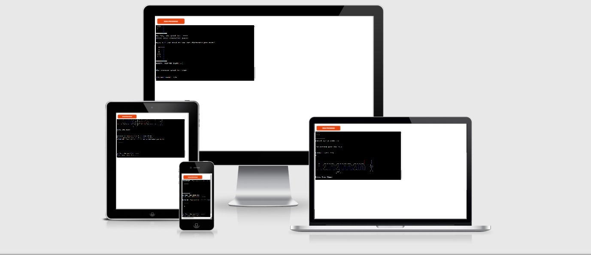
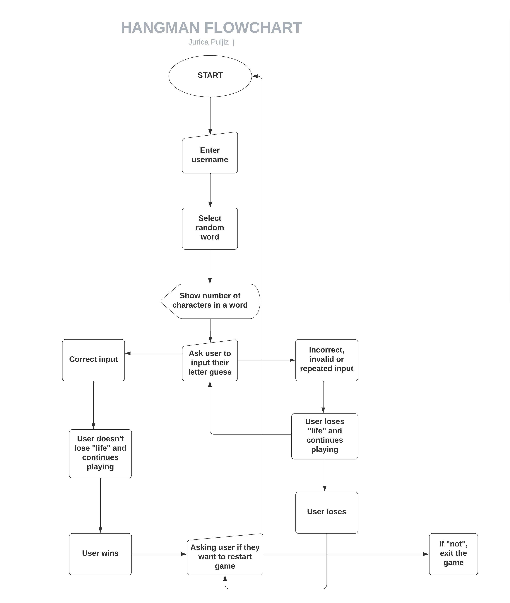
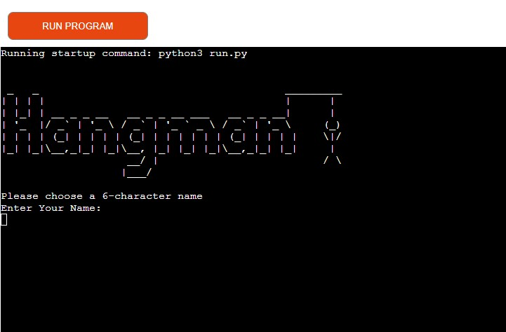
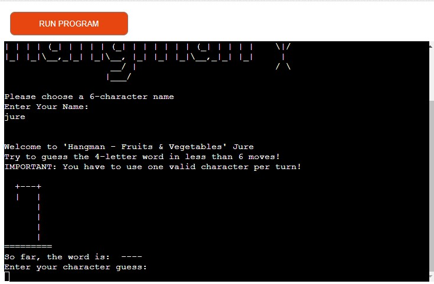
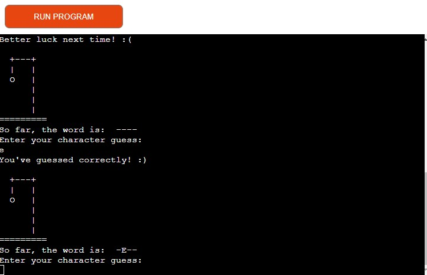
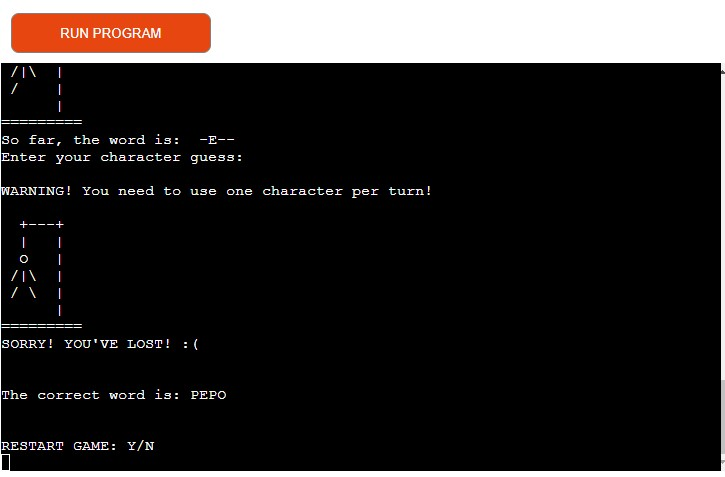
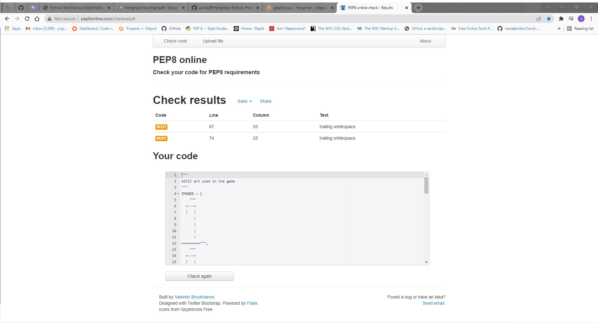

<h1 align=center> Hangman</h1>

PLAY AND HAVE FUN!

"Hangman" is a classic paper and pencil guessing game where player needs to guess letters contained within a word, which ultimately brings user to the reveal of the secret word.  
 

Live app link [here](https://hangman-pythonproject3.herokuapp.com/)

 ## Project Purpose

Create a fun game for users of all ages.

## User Experience

### User Stories

+ As a user, I would like to be able to …

1. have an easy interactive experience
2. easily see the feedback and progress
3. easily play again upon finishing the game

### App Owner Stories

+ As App Owner Stories, I would like to be able to provide …

1. a simple, straightforward intuitive user experience;
2. clear and input relevant feedback
3. possibility of restarting the game at the end

## Functional Scope 

The following flowchart shows the flow of "Hangman" graphically.

## Features

### Username input

Ask user to input a valid username.

### Welcome message

Introductory messages and basic display of main game components.

### Feedback message

Feedback message and graphics relevant to the input.
Images change if user loses lives, if not then image stays the same.

### End game message

Feedback message and graphics relevant to users' progress during the game.

## Future Features

I would like to ...

1. add more levels of difficulties with various words;
2. add hints which could help user to find out the secret word more easily;
3. add option for storing the highscores;

## Languages Used

Python 3.0

## Frameworks, Libraries & Programs Used
1. Git: 
Git was used for version control by utilizing the Gitpod terminal to commit to Git and Push to GitHub.
2. GitHub: 
GitHub is used to store the project's code after being pushed from Git.
3. Heroku: 
Heroku is used for deployment of the project.

## Testing and Code validation 

Code was tested multiple times manually and all files were tested in PEP8 online validator.

Only these messages came up as related to ASCII art file:

The other two files had no error or warning messages displayed in PEP8.

## Deployment 

This app is deployed using Heroku.

### Heroku Deployment steps
 
 1. Ensure all dependencies are listed on requirements.txt. 
 
 Write on python terminal ` pip3 freeze > requirements.txt` and a list with all requirements will be created to be read by Heroku. 
 
 2. Setting up your Heroku

    1. Go to Heroku website (https://www.heroku.com/). 

    2. Login to Heroku and go to Create App

    3. Click in New and Create a new app  

    4. Choose a name and set your location

    5. Navigate to the deploy tab

    6. Click in Connect to Github and search for 'jurica29' GitHub account and 'Hangman' repository

    7. Navigate to the settings tab

    8. Click on Add a buildpack on the same page. Select Python and node.js, ensuring Python is listed first after you save the changes.

3. Deployment on Heroku

    1.  Navigate to the Deploy tab.

    2.  Choose main branch to deploy and enable automatic deployment to build Heroku everytime any changes are pushed on the repository.
    
    3.   Click on manual deploy to build the app.  When complete, click on View to redirect to the live site. 
    
### Forking the GitHub Repository

* By forking the GitHub Repository you will be able to make a copy of the original repository on your own GitHub account allowing you to view and/or make changes without affecting the original repository by using the following steps:

    Log in to GitHub and locate the GitHub Repository
    At the top of the Repository (not top of page) just above the "Settings" button on the menu, locate the "Fork" button.
    You should now have a copy of the original repository in your GitHub account.

* Making a Local Clone

    Log in to GitHub and locate the GitHub Repository
    Under the repository name, click "Clone or download".
    To clone the repository using HTTPS, under "Clone with HTTPS", copy the link.
    Open Git Bash
    Change the current working directory to the location where you want the cloned directory to be made.
    Type git clone, and then paste the URL you copied in Step 3.

$ git clone https://github.com/jurica29/Hangman/

Press Enter. Your local clone will be created.

# Credits

### Work based on other code

[Udemy Python Bootcamp](https://www.udemy.com/course/100-days-of-code//) - Used as an inspiration for the concept of the game. 

# Acknowledgements

+ To the Slack community as I have used the different channels to find answers to problems!
+ Stack Overflow is a valuable resource for solving lots of issues.
+ W3schools and Python libraries documentation for general reference.

I would also like to thank:

+ My fiancée Maja for her patience and support.
+ My mentor Rahul Lakhanpal for his time, support and guidance.

